# Chauffeur

Chauffeur rides along with your OpenCode agent. It watches what the agent is
about to do and steps in when it matters: it hands the agent the right skill,
approves the permission prompts you would have approved anyway, stops the
shortcuts you would have stopped, and keeps a goal running until it is done.

Each decision is a quick yes/no judgment by [Jev](https://typesafe.ai), a small
fast model, so it adds about a third of a second, not another agent turn.

## What it does for you

### The right skill, without the token bill

Chauffeur reads your message and attaches only the skills it needs. It hides
OpenCode's full skill list and the tool groups a task won't use, and brings them
back if a later message does.

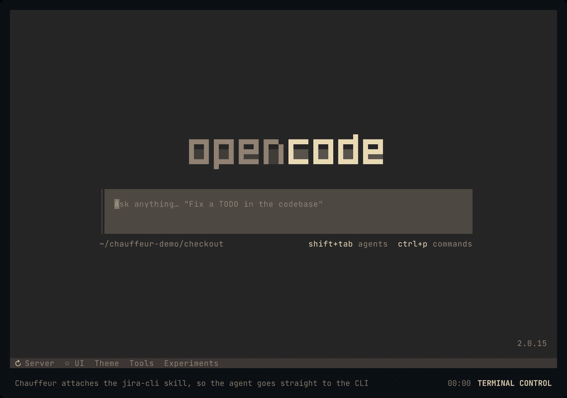

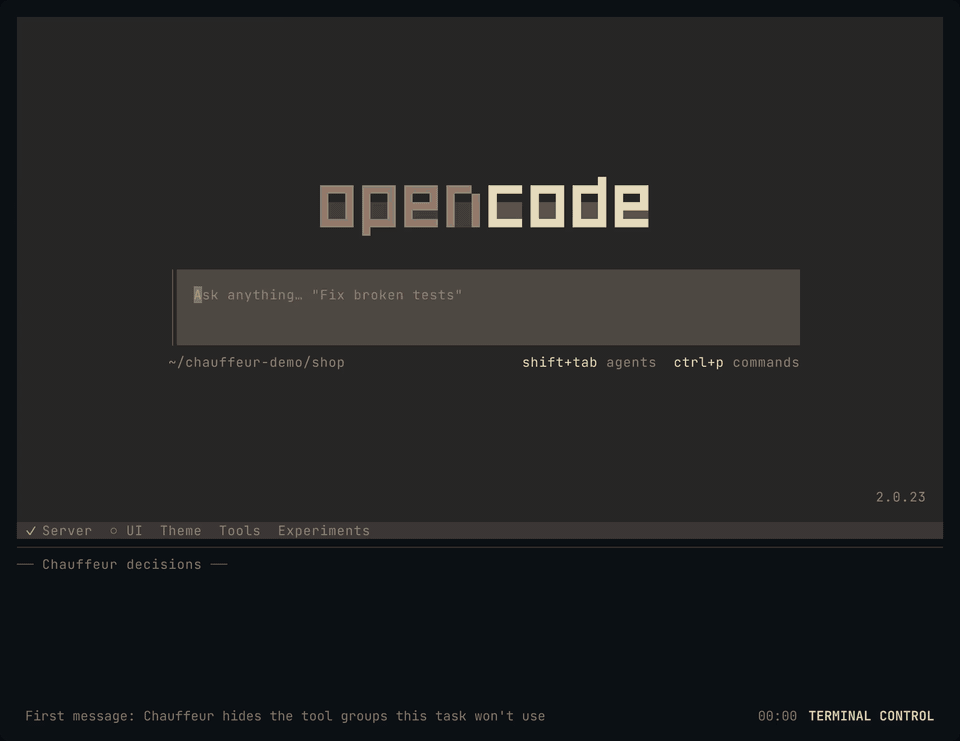

The decision feed under OpenCode is `chauffeur audit --follow --brief`.

On our longer benchmark tasks, this used 29% fewer input tokens and finished
19% faster than plain OpenCode, with the same or better pass rate
([`bench/`](bench)).

### Fewer permission prompts, and the right ones

- **Approves** what clearly serves your task: an edit in the project, a file
  you named, a sibling worktree of the same repository when the agent says why.
- **Asks you** about the rest: unrelated folders, credential stores such as
  `~/.ssh`, anything it is unsure of.
- **Blocks** irreversible harm (`rm -rf /`) and shell rewrites of project files
  (`sed -i`, `node -e`, heredocs), pointing the agent at the edit tools, so every
  change stays reviewable. A force-push to `main` always asks.

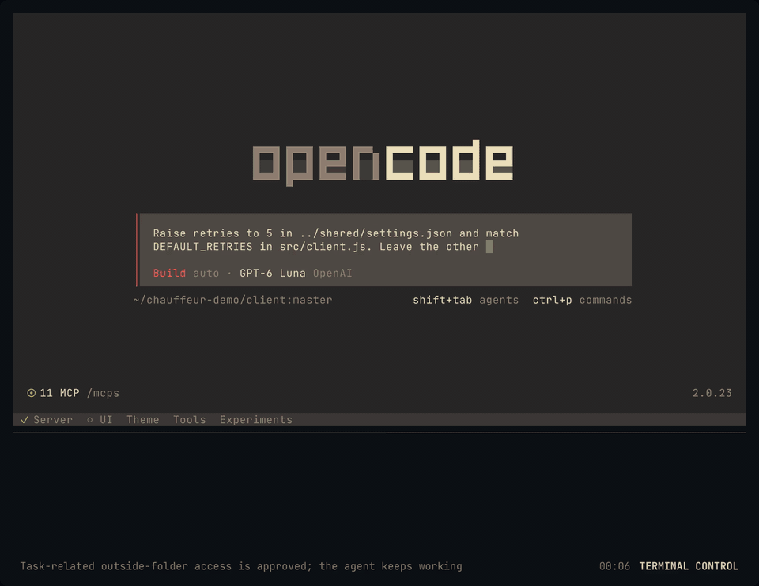

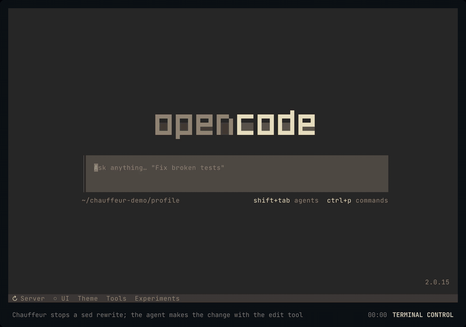

### Secrets stay out of the judge's context

Chauffeur redacts credential-shaped strings before sending context to Jev.
This protects the judge request, not OpenCode's own transcript. Here, the
right pane shows the user message extracted from the recorded Jev request.

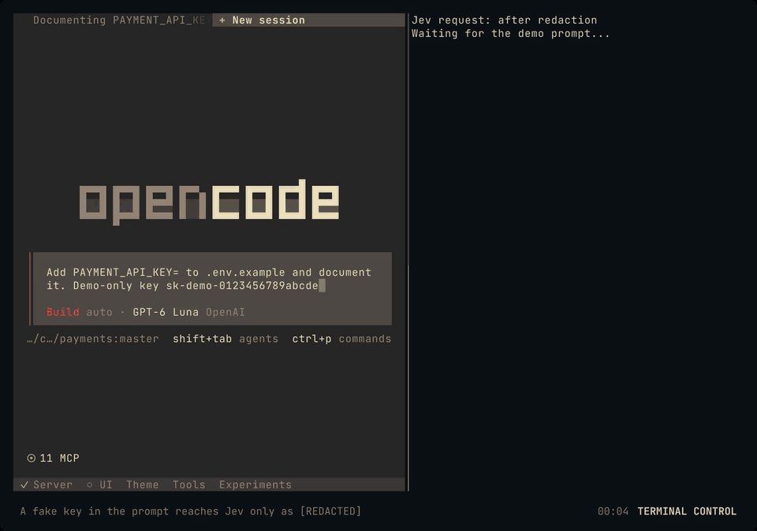

### Steers when the agent drifts

After a tool call, Chauffeur nudges the agent back on course, and hands over the
matching skill when there is one: `cat` or `sed -n` instead of the read tool,
a recursive `grep` instead of `rg`, a browser for GitHub, Slack, Jira, or X
where `gh`, `slackcli`, `jira`, or `twitter-cli` does it directly. Add your
own rules for every session in `~/.config/chauffeur/rules/`, or a project's in
its `.chauffeur/rules/`.

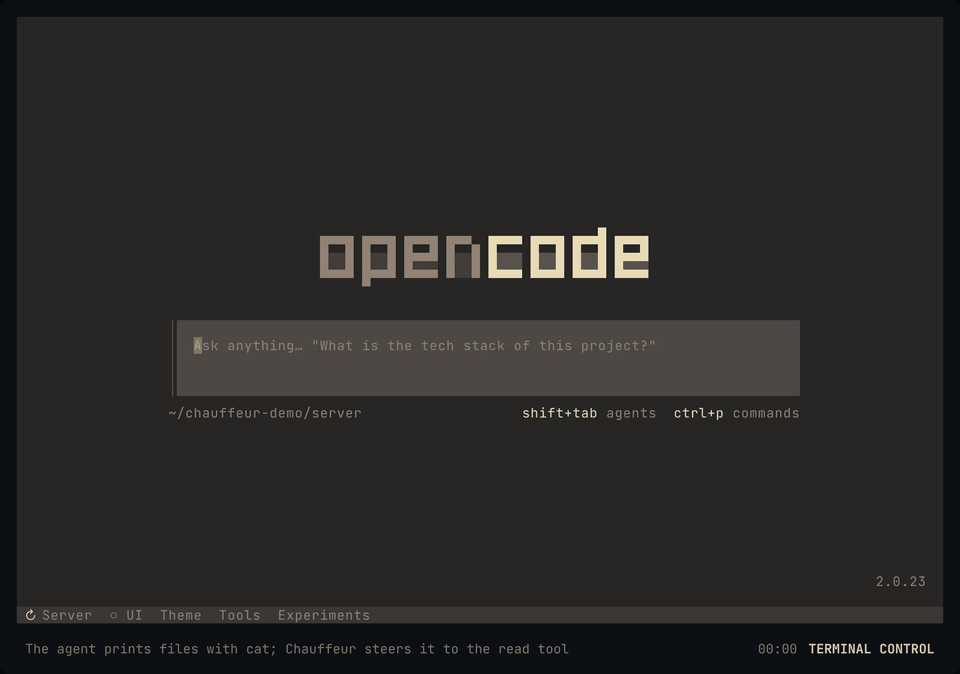

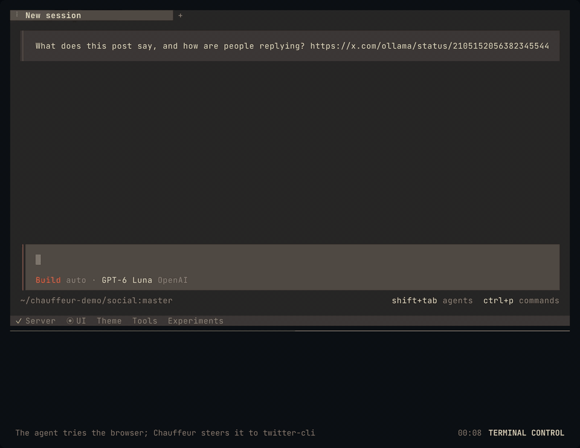

### Rulebooks: `/goal` and your own

A rulebook is a set of rules you switch on for one session with a slash command.

**`/goal <objective>`** has the agent break the objective into todos with
Chauffeur's `todowrite` tool, then keeps it working across turns, naming the
open todos each time. It cannot finish while a todo is open, and it ends once
the evidence shows the goal is met. It pauses when only you can unblock it, and
stops after 20 continuations with a progress summary.

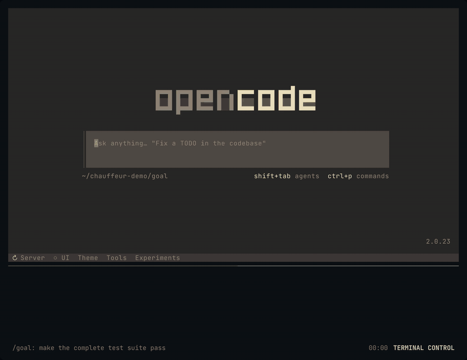

Add your own in `skills/rulebooks/`, or per project in `.chauffeur/rulebooks/`
([format](skills/README.md#rulebooks)).

Here, a project's `release.json` defines `/release`: bump the version, update
the changelog, run tests, commit and tag locally, then check the evidence.

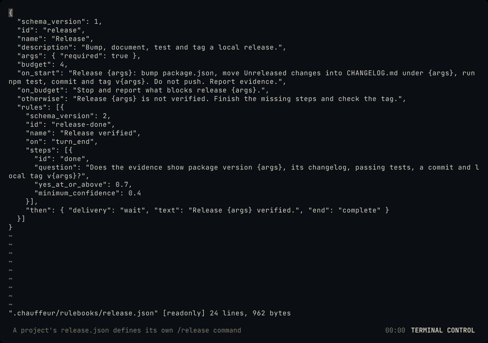

### Ask for what's missing

With **`ask_chauffeur`**, the agent can ask in plain words for a tool or skill
it lacks, then use what Chauffeur grants to finish the task.

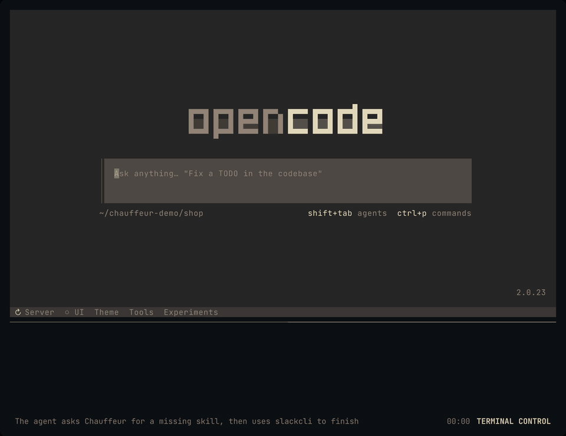

### And quietly

- **Model failover**: a usage limit covers the whole provider account, so
  Chauffeur switches to the same tier on another provider you use directly
  (your Anthropic or OpenAI subscription, recommended models first, never an
  OpenCode copy of them), uses OpenCode's free models only when nothing else is
  left, and switches back once the limit has likely cleared.

  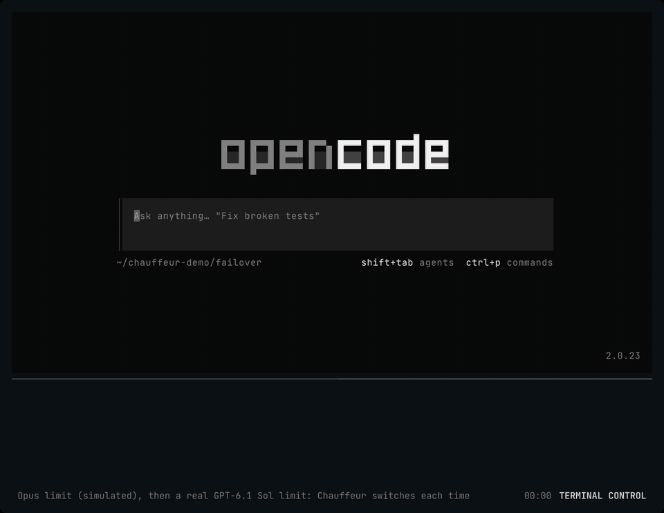

  In this clip, a local endpoint stands in for Anthropic and returns a usage
  limit. The GPT-6.1 Sol limit that follows is a real one.
- **Cheaper subagents**: when the agent hands routine work such as searching,
  reading or mechanical edits to a subagent, Chauffeur steers it to a cheaper
  model from the same provider, such as Sonnet under Opus.
- **[sourcefed](https://github.com/StevenJPx2/sourcefed) events**: Chauffeur sets up
  monitors for the PR, Jira issue, or Slack thread you are working on, and lets
  through only the events the agent needs to act on.

  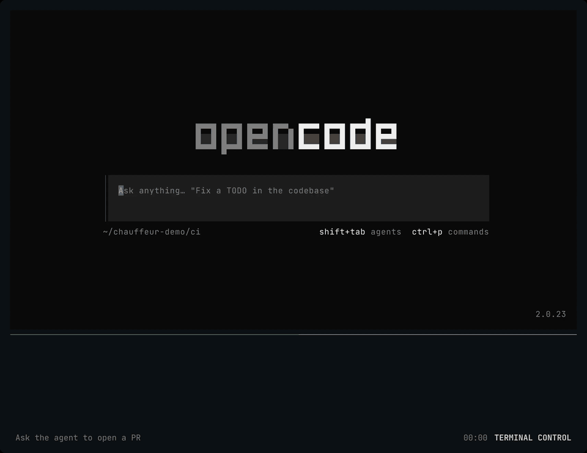

  The repository (a throwaway private one) and its CI failure are real. Delivery of monitors Chauffeur creates mid-session needs
  sourcefed after 0.3.4
  ([28f4464](https://github.com/StevenJPx2/sourcefed/commit/28f4464)), which
  this clip runs.

## Install

You need Rust, Node.js, OpenCode 2, and a TypeSafe API key.

```sh
export TYPESAFE_API_KEY=...          # Jev; the daemon will not start without it
export CHAUFFEUR_IDLE_STEERING=true  # lets rulebooks continue the agent between turns

git clone https://github.com/StevenJPx2/chauffeur && cd chauffeur
cargo install --locked --path crates/cli             # the chauffeur daemon and CLI
mkdir -p ~/.config/chauffeur && ln -s "$PWD/skills" ~/.config/chauffeur/skills
ln -s "$PWD"/skills/handoff/* ~/.agents/skills/      # skills Chauffeur hands over
cd adapters/opencode && npm install && npm run deploy
opencode service restart
```

`npm run deploy` checks and builds the plugin, then installs it as
`~/.config/opencode/plugins/chauffeur.js`. The plugin starts the daemon when
none is running. If Jev is unreachable, Chauffeur stands aside: prompts go
through unchanged and permission requests fall back to asking you.

## See what it decided

Every decision is logged, with the questions asked and how long they took:

```sh
chauffeur audit                   # the last 20 decisions
chauffeur audit 100
chauffeur audit --follow --brief  # new decisions as they happen, one short line each
```

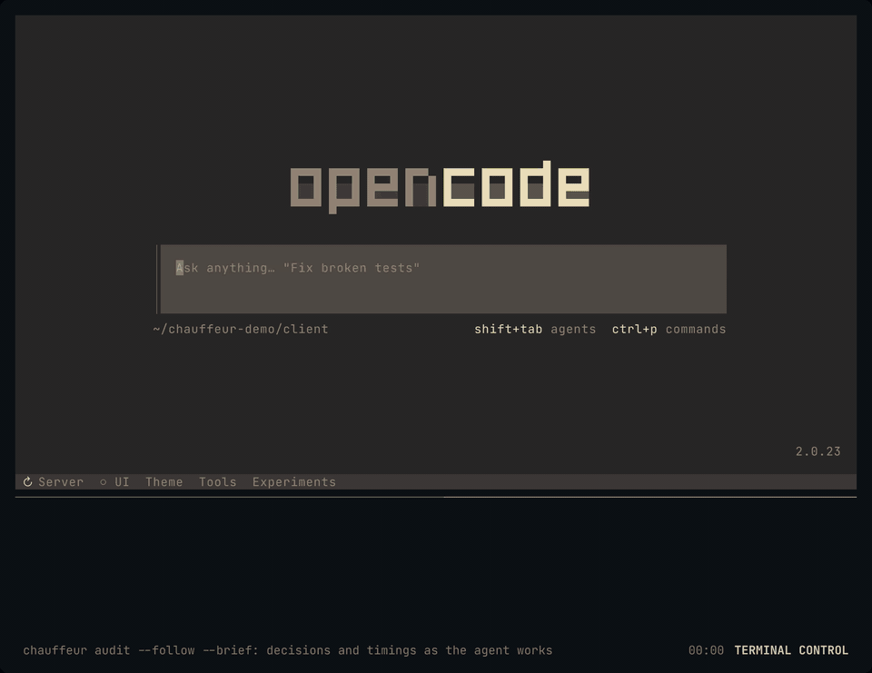

```text
00:16:40 UTC ses_f32a1b… user_message Check my latest Twitter mentions → attach_skills ["twitter-cli"] | 1 asked, 493 ms
00:16:42 UTC ses_f32a1b… permission_request shell rm -rf / → permission deny | 0 asked, 0 ms; vetoed: rm -rf /
```

## Configure

| Variable | Default |
|---|---|
| `TYPESAFE_API_KEY` | required |
| `CHAUFFEUR_IDLE_STEERING` | `false`; `true` lets turn-end rules and rulebooks resume the agent |
| `CHAUFFEUR_CONFIG_DIR` | `~/.config/chauffeur`; per-capability overrides as JSON, and your own `rules/` |
| `CHAUFFEUR_SKILLS_DIR` | `~/.config/chauffeur/skills` (a link to `skills/`) |
| `CHAUFFEUR_STATE_DIR` | `~/.local/state/chauffeur` (session memory, audit log) |
| `CHAUFFEUR_DAEMON_URL` | `http://127.0.0.1:18790` |
| `CHAUFFEUR_SOURCEFED` | on; `off` leaves sourcefed alone |

Rules, rulebooks, and permission contracts are strict JSON in [`skills/`](skills);
[`skills/README.md`](skills/README.md) documents each format, and
`chauffeur skill validate PATH` checks a file. [`ARCHITECTURE.md`](ARCHITECTURE.md)
covers the design.

The words are config too. Every question Chauffeur asks Jev and every message
it shows lives in a `texts` object in [`skills/config/`](skills/config), and the
plugin's tool descriptions and replies live in
[`skills/config/hosts/opencode.json`](skills/config/hosts/opencode.json). To
reword one, name only that text in your file of the same name:

```json
// ~/.config/chauffeur/hosts/opencode.json
{ "todowrite": { "empty": "No todos yet." } }
```

Edits apply without a restart. Within a second, the daemon picks up rules,
rulebooks, contracts, and wording in `skills/` and overrides in
`~/.config/chauffeur/`, keeping session memory and running rulebooks; the plugin
re-registers its tools with new wording within five seconds. A file that fails
to load, such as one naming a placeholder its text does not accept, leaves the
previous version running and logs why.

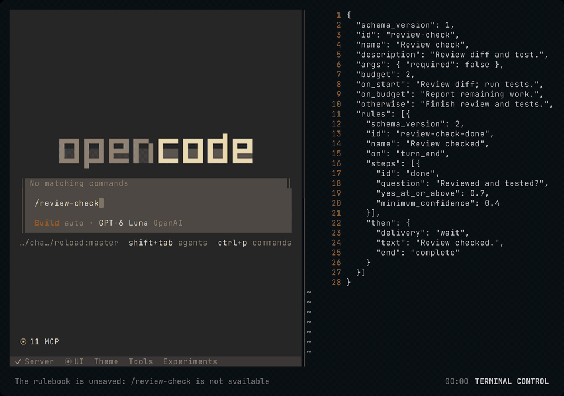

This clip uses a private, patched OpenCode 2.0.23 build. The stock release can
leave autocomplete stale because background registry updates omit their project
location. The [patch](docs/patches/opencode-2.0.23-command-location.patch) keeps
that location on command updates; your installed OpenCode is not modified by
Chauffeur.

## Develop

```sh
cargo fmt --all -- --check
cargo clippy --workspace --all-targets --locked -- -D warnings
cargo test --workspace --locked
cd adapters/opencode && npm run check   # types, lint, tests, fallow audit
```

`chauffeur-bench` compares OpenCode with and without Chauffeur on a task suite;
see [`bench/README.md`](bench/README.md).

The demos above were recorded with
[terminal-control](https://github.com/anomalyco/terminal-control) in throwaway
repositories, with stub `jira`, `slackcli` and `twitter` CLIs. Twitter replies
are fixtures. The ask demo's `AGENTS.md` requires a Slack handoff and supplies
the question the agent asks Chauffeur.
The `/goal` demo's project policy allows one failing test file to be fixed per
turn, making its real automatic continuation visible.
